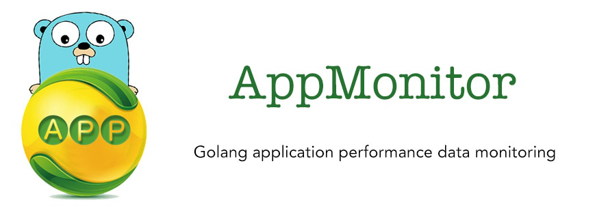
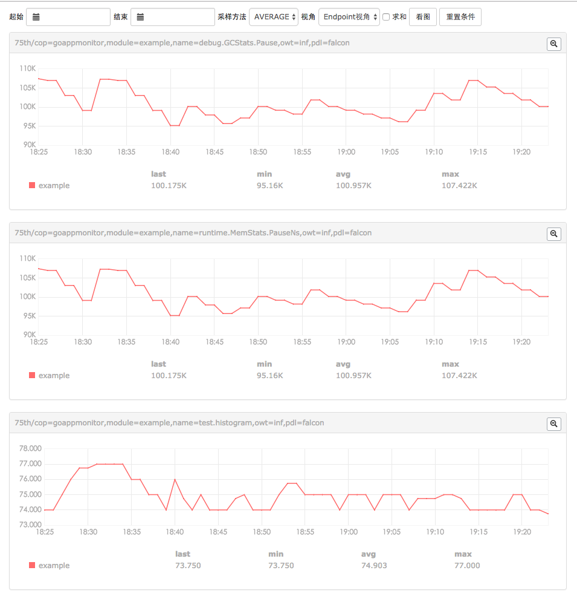

# goappmonitor
[](https://travis-ci.org/wgliang/goappmonitor)
[](https://codecov.io/gh/wgliang/goappmonitor)
[](https://godoc.org/github.com/wgliang/goappmonitor)
[](https://gitter.im/goappmonitor/Lobby?utm_source=badge&utm_medium=badge&utm_campaign=pr-badge&utm_content=badge)
[](https://landscape.io/github/wgliang/goappmonitor/master)
[](https://goreportcard.com/report/github.com/wgliang/goappmonitor)
[](http://www.apache.org/licenses/LICENSE-2.0.html)

Golang application performance data monitoring.


GoAppMonitor is a library which provides a monitor on your golang applications. It contains system level based monitoring and business level monitoring(custom monitoring).Just add the repository into your apps and register what you want to monitoring.

## Summary

Using GoAppMonitor to monitor the golang applications, in general as following:

In your golang application code, the user calls the statistics function provided by goappmonitor; when the statistics function is called, the appmonitor generates a statistical record, and is stored in memory.GoAppMonitor will automatically and regularly record these statistics push to the agent such as Open-Falcon agent.

## Version

Current version support:

- v0.0.2

	* [Open-Falcon](https://github.com/XiaoMi/open-falcon) (Open source monitoring system of Xiaomi)
	* [InfluxDB](https://github.com/influxdata/influxdb) (Scalable datastore for metrics, events, and real-time analytics)

### todo....

* support more agent frameworks,such as elasticsearch...
* go processes manager and debug online...


## Install

    go get github.com/wgliang/goappmonitor


## Demo



## Usage

Below is an example which shows some common use cases for goappmonitor.  Check 
[example](https://github.com/wgliang/goappmonitor/blob/master/example) for more
usage. 

Detail [API](./doc/API.md)

```go
package main

import (
	"math/rand"
	"time"

	appm "github.com/wgliang/goappmonitor"
)

// Base or system performance data,such as memeory,gc,network and so on.
func baseOrsystem() {
	for _ = range time.Tick(time.Second * time.Duration(10)) {
		// (commonly used) Meter, used to sum and calculate the rate of change. Use scenarios
		// such as the number of home visits statistics, CG etc..
		pv := int64(rand.Int31n(100))
		appm.Meter("appm.meter", pv)
		appm.Meter("appm.meter.2", pv-50)

		// (commonly used) Gauge, used to preserve the value of the instantaneous value of the
		// type of record. Use scenarios such as statistical queue length, statistics CPU usage,
		// and so on.
		queueSize := int64(rand.Int31n(100) - 50)
		appm.Gauge("appm.gauge", queueSize)

		cpuUtil := float64(rand.Int31n(10000)) / float64(100)
		appm.GaugeFloat64("appm.gauge.float64", cpuUtil)
	}
}

// Custom or business performance data,such as qps,num of function be called, task queue and so on.
func customOrbusiness() {
	for _ = range time.Tick(time.Second) {
		// Histogram, using the exponential decay sampling method, the probability distribution of
		// the statistical object is calculated. Using scenarios such as the probability distribution
		// of the statistics home page to access the delay
		delay := int64(rand.Int31n(100))
		appm.Histogram("appm.histogram", delay)
	}
}

func main() {
	var ch chan int
	go baseOrsystem()
	go customOrbusiness()
	<-ch
}
```

## Credits

Repository is base on goperfcounter of [niean](https://github.com/niean/goperfcounter)

Logo is desigend by [xuri](https://github.com/Luxurioust)
